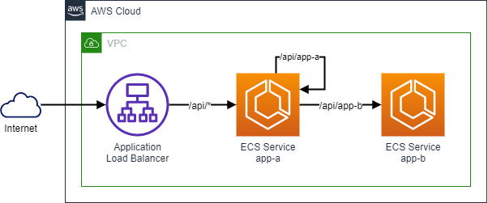

# Microsserviços em AWS Fargate

Este é um exemplo de como executar 2 aplicações em containers (simuladas através do Nginx)
app-a e app-b dentro da AWS usando o AWS Fargate. O funcionamento deste ambiente está ilustrado 
no diagrama abaixo:

O ambiente expõe a applicação **app-a** para a Internet através de um load balancer público. Acessando o DNS deste balancer com a URI `/api/app-a` a requisição é redirecionada às tasks ECS da aplicação **app-a** o qual a responde diretamente ao cliente.

Se for usado a URI `/api/app-b` o load balancer manda a requisição às tasks de **app-a** que por sua vez redireciona a mesma para as tasks de **app-b** que devolve a resposta. 

Ambas as aplicações retornar um JSON `{}` com 200 OK se tudo der certo.

## Criação do ambiente

Para criar este ambiente você precisa de uma conta AWS com credenciais disponíveis na sua máquina (por exemplo, é possível deixar as credenciais em ~/.aws/credentials e usar as variables AWS_PROFILE e AWS_REGION no seu terminal bash para acesso a conta) e também de uma versão recente do terraform 0.13 instalado.

Para construir o ambiente siga estes passos:

- No console da AWS acesse o CodeCommit e crie dois repositórios app e app-b.
- Copie o conteúdo dos diretórios `docker/app-a` e `docker/app-b` deste repositório para dentro de cada repositório respectivamente criado no passo anterior. É possível fazer isso via upload do próprio console ou configurando os repositórios git em sua máquina e fazendo commit/push, conforme preferir.
- Altere o arquivo ngix.conf do app-a mudando o server no upstream app-b de `server app-b:8080` para `server app-b.discovery.ecs-fargate-intro.cloud:8080`
- Entre nos diretórios abaixo e para cada um execute os comandos `terraform init && terraform apply -auto-approve`:
  - terraform/codepipeline-a
  - terraform/codepipeline-b
  - terraform/networking
  - terraform/cluster
  - terraform/app-a
  - terraform/app-b

Fique a vontade para inspecionar os códigos de terraform ou usar um procedimento diferente para construir a infra. A descrição de cada módulo está na sessão a seguir.

Isso vai construir todas as partes necessárias para execução da infra. Para destruir a infra (pois ela tem um custo por hora de alguns dólares) use o comando `terraform destroy -force` nos diretórios usados pelo terraform de baixo para cima.

Também é preciso apagar manualmente os dois repos git no CodeCommit.

# Conteúdo dos diretórios

Cada diretório deste repo tem sua função:

- docker/*: o código fonte de cada aplicação, que são compostos por um Dockerfile (executado pela pipeline) e um nginx.conf personalizado para *simular* uma API.
- terraform/codepipeline-*: uma pipeline de build de cada aplicação. Ela é composta por um CodeBuild Project, uma pipeline no CodePipeline e um repositório OCI no ECR. Cada modificação no CodeCommit dispara respectivamente o processo de build.
- terraform/networking: cria a VPC, DNS privado e outros componentes requeridos de rede. A VPC possui subnets públicas (onde ficam NAT Gateways e um ALB público criado por outro módulo) e privadas (onde o ECS roda as Tasks). Também cria um bastion em EC2 com Ubuntu 20 acessível via Session Manager, que é útil para fazer testes internos.
- terraform/cluster: constroi o ECS Cluster e o ALB público.
- terraform/app-*: constroi os ECS Service e ECS Task Definition e outros elementos associados a eles. 
- modules/codepipeline: módulo terraform compartilhado pelas pipelines.
- modules/ecs: módulo terraform compartilhando pelas aplicações.

